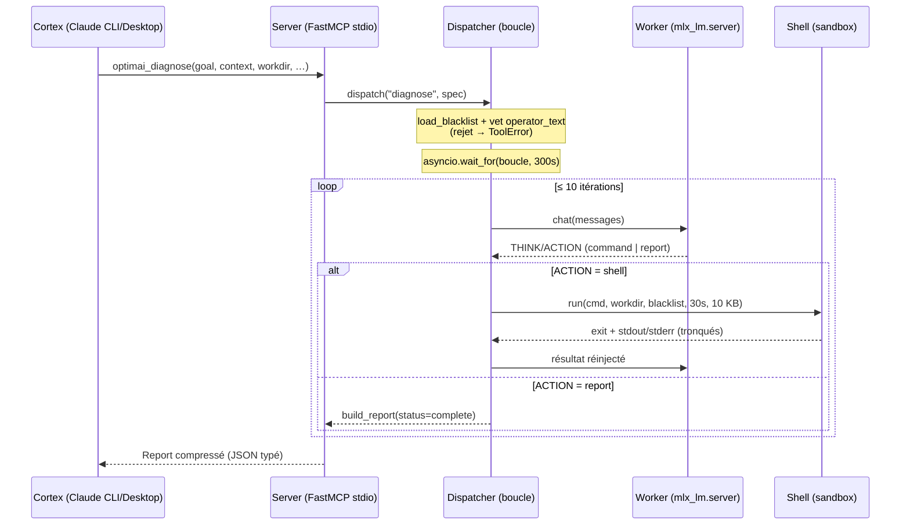

# Architecture — optimAI

> Phase 1. Vue d'ensemble du système Cortex / Dispatcher / Hands et du flux
> d'une requête. Les chiffres et comportements décrits ici sont ceux du code
> (`src/optimai/`), pas une cible. Référence des décisions : [`../DECISIONS.md`](../DECISIONS.md).

## 1. Les trois couches (DEC-001)

optimAI déporte les tâches mécaniques (diagnostics itératifs, packs de
commandes shell) d'un modèle Claude coûteux vers un worker local, en gardant
Claude comme couche de décision.

| Couche | Qui | Rôle | Ne fait PAS |
|--------|-----|------|-------------|
| **Cortex** | Claude (Desktop / CLI / API) | Comprend le problème, formule une Task Spec, lit le rapport, décide de la suite | N'exécute pas de shell, ne boucle pas |
| **Dispatcher** | Python local, serveur MCP (`src/optimai/`) | Orchestre la boucle bornée, applique les garde-fous, compresse le résultat | Ne « réfléchit » pas au domaine — il est agnostique du pattern |
| **Hands** | `mlx_lm.server` + Qwen2.5-Coder-32B-Instruct-4bit (DEC-017, DEC-018) | Itère : propose une commande, lit le résultat, recommence, conclut | Ne décide pas des limites ni de la sécurité |

Le gain : une boucle de 5–10 allers-retours worker↔shell qui aurait consommé
des milliers de tokens Cortex se résume, côté Cortex, à **un appel d'outil + un
rapport compressé**.

## 2. Flux d'une requête

Le serveur ne connaît ni Diagnose ni Execute par leur nom : il **itère le
registre de patterns** et fabrique un outil `optimai_<name>` par entrée
(DEC-021). Ajouter un pattern Phase 2 = un fichier + `@register("…")`, sans
toucher `server.py`.

## 3. Le Dispatcher en détail (`dispatcher.py`)

`dispatch(pattern_name, spec)` enchaîne, dans cet ordre :

1. **Résolution du pattern** depuis le registre (`get_pattern`, `KeyError` si
   inconnu — pas de fallback, DEC-008 §4).
2. **Chargement de la blacklist** : fichier de base (`config/blacklist.txt`) +
   `spec.extra_blacklist` propre à la tâche.
3. **Vérification pré-vol de l'`operator_text`** (defense in depth, DEC-008) :
   le texte opérateur à haut niveau (le `goal`, et pour Execute aussi le pack de
   commandes) est scanné contre la blacklist *avant* tout lancement. Un match →
   `PatternRejected` → `ToolError` MCP propre côté Cortex. Le `spec.context`
   (savoir métier) n'est volontairement **pas** scanné : il peut légitimement
   mentionner des tokens sensibles.
4. **Boucle sous budget global** : `asyncio.wait_for(_run_loop, timeout=300s)`.

La boucle (`_run_loop`) est le **seul** endroit où vit la mécanique itérative.
À chaque tour : appel worker → `pattern.parse()` produit un `Step`
(`command` / `final` / `invalid`).

- `command` → exécution shell sandboxée ; le résultat (exit + stdout/stderr
  tronqués) est réinjecté au worker.
- `final` → `pattern.build_report(status="complete", stop_reason="converged")`.
- `invalid` → **une** correction est demandée au worker ; au 2ᵉ échec, report
  d'erreur (`worker_error`).

La boucle reste **agnostique du pattern** : elle consomme des `Step` et rend la
trace à `build_report`. Aucun import Diagnose/Execute dans `dispatcher.py` —
c'est l'invariant qui rend l'« axe 1 absorbé par le registre » de DEC-021
vérifiable.

## 4. Limites de boucle (DEC-007, `config.py`)

Source de vérité unique : `Settings` (chargé une fois, env / `.env`).

| Limite | Valeur défaut | Variable d'env | Appliquée par |
|--------|---------------|----------------|---------------|
| Itérations max | **10** | `OPTIMAI_MAX_ITERATIONS` | compteur de boucle → `max_iterations` / `incomplete` |
| Budget global | **300 s** (5 min) | `OPTIMAI_TIMEOUT_SECONDS` | `asyncio.wait_for` autour de la boucle → `timeout` / `incomplete` |
| Sortie max | **10 240 octets** (10 KB) | `OPTIMAI_MAX_OUTPUT_BYTES` | troncature stdout/stderr par commande |
| Timeout par-commande | **min(30 s, budget global)** | dérivé | `asyncio.wait_for` autour de chaque commande → politique DEC-022 |

Une variable d'env malformée lève `ValidationError` telle quelle — échec
explicite, pas de fallback silencieux (DEC-008 §4).

## 5. Garde-fous sécurité (DEC-008, `shell.py`)

Quatre couches, dans `shell.py` (le module le plus sensible du projet) :

1. **Blacklist** — patterns regex refusés *avant* tout lancement de
   sous-processus. `search` (pas `match`) : un token interdit est attrapé
   n'importe où dans la commande. Une regex invalide échoue au *chargement*,
   pas au runtime.
2. **Sandbox de chemin** — le `cwd` du sous-processus est épinglé au `workdir`
   de la tâche. `validate_path_in_sandbox` suit les symlinks
   (`resolve(strict=False)`) pour attraper une évasion par lien. *Phase 1
   applique la sandbox au `cwd` ; l'analyse statique des chemins dans les
   arguments `/bin/sh -c` est explicitement reportée en Phase 4.*
3. **Env explicite** — seuls `PATH` / `HOME` / `LANG` sont transmis au
   sous-processus. Aucune variable parent contenant `TOKEN`/`KEY`/`SECRET`/
   `PASSWORD` n'atteint jamais le shell.
4. **Troncature de sortie** — plafonnée à `max_output_bytes` (10 KB) avec un
   marqueur `[TRUNCATED: N more bytes]` visible.

Le `workdir` lui-même est validé en amont, à la construction du spec : il doit
être un chemin **existant** (`resolve(strict=True)` dans le validateur Pydantic).
Un `workdir` inexistant fait échouer l'appel d'outil immédiatement — voir la
note « pas de fallback » dans [`PATTERNS.md`](PATTERNS.md).

## 6. Worker (`worker.py`, DEC-017 / DEC-018)

Le worker est un client HTTP async (`httpx`) vers `mlx_lm.server`, endpoint
OpenAI-compatible `http://127.0.0.1:1337/v1` (loopback uniquement, DEC-012),
modèle `mlx-community/Qwen2.5-Coder-32B-Instruct-4bit`. Un échec d'appel lève
`WorkerError`, que la boucle transforme en report `worker_error` / `error`.

Le serveur d'inférence est lancé **manuellement par Hassan** (opération
privilégiée) ; il n'est pas géré par optimAI. Tant qu'il n'écoute pas sur
`127.0.0.1:1337`, tout appel d'outil renvoie un report d'erreur — voir
[`../TROUBLESHOOTING.md`](../TROUBLESHOOTING.md).

## 7. Transport MCP (DEC-005)

Serveur **FastMCP en stdio**. Conséquences structurantes :

- **stdout = canal JSON-RPC.** Aucun `print`, aucune bannière sur stdout — cela
  corromprait le protocole. Les logs vont dans un fichier
  (`logs/optimai.log`), avec un miroir `ERROR` sur stderr uniquement
  (`_configure_logging`).
- **Lancement** : `uv --directory <repo optimAI> run python -m optimai.server`.
  Le `--directory` fixe le `cwd` sur le repo optimAI → `.env`, blacklist et
  `.venv` s'y résolvent, **quel que soit le projet appelant**.
- **Intégration** : Claude Desktop (étape 9) et Claude CLI au scope `user`
  (étape 10, DEC-023). Une entrée, visible dans tous les projets.

## 8. Pour aller plus loin

- Spécification des patterns A & D, schémas d'E/S, exemples d'appel réels :
  [`PATTERNS.md`](PATTERNS.md).
- Pièges d'exploitation et diagnostic : [`../TROUBLESHOOTING.md`](../TROUBLESHOOTING.md).
- Journal des décisions : [`../DECISIONS.md`](../DECISIONS.md).
